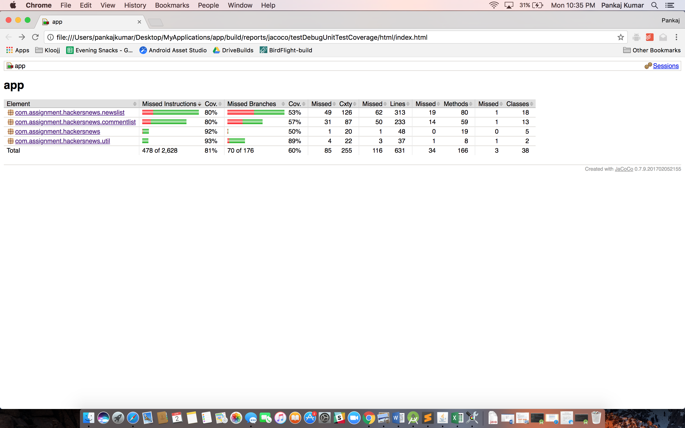

# HN
HN

Jacoco has been enabled with http://robolectric.org/ for this application.

To Run test coverage report, execute `./gradlew --info testDebugUnitTestCoverage`. This will execute test cases and will prepare test report at `app/builds/reports/jacoco/testDebugUnitTestCoverage/html/index.html`.

Current coverage report

